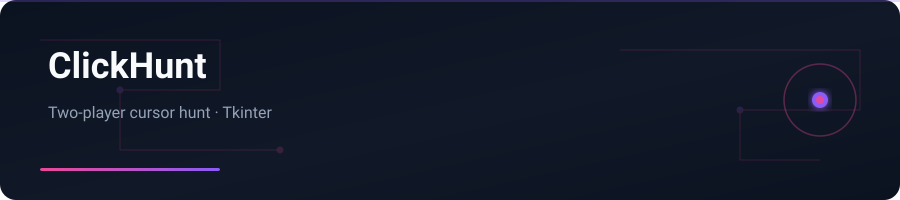

<div align="center">



</div>

# ClickHunt

One click. One ghost. One second to remember it. — Two-player fullscreen cursor-hunt game (Python + Tkinter).

---

## English


### Features

- Player 1 double-clicks to hide a target; cursor disappears
- Player 2 gets 5 attempts to find it by distance
- Fullscreen UI, standard-library only
- No external dependencies

### Stack

Python 3 · Tkinter · math

### Getting started

```bash
git clone https://github.com/yasinfallahati/ClickHunt.git
cd ClickHunt
python "بازی دونفره با موس.py"
```

---

## فارسی

### کلیک‌هانت

بازی دونفره شکار نشانگر ماوس تمام‌صفحه با پایتون و Tkinter.


### امکانات

- بازیکن ۱ با دابل‌کلیک هدف را مخفی می‌کند؛ نشانگر محو می‌شود
- بازیکن ۲ پنج شانس دارد تا با فاصله هدف را پیدا کند
- رابط تمام‌صفحه، فقط کتابخانه استاندارد
- بدون وابستگی خارجی

### تکنولوژی‌ها

Python 3 · Tkinter · math

### شروع کار

```bash
git clone https://github.com/yasinfallahati/ClickHunt.git
cd ClickHunt
python "بازی دونفره با موس.py"
```

---

`#python` `#tkinter` `#game` `#two-player` `#desktop`
