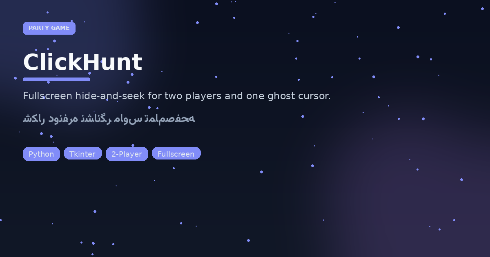

<p align="center">
  
</p>

# ClickHunt
### One click. One ghost. One second to remember it.

<p align="center">


</p>

**Tone:** party / couch co-op — not a productivity app.

## How a round works

1. **Player 1** double-clicks somewhere on the fullscreen canvas to hide the target.
2. Cursor vanishes. **Player 2** gets **5** clicks to land within **50px** of the ghost point.
3. Hit → seeker wins. Miss out → hider wins and the coordinate is revealed.
4. `Esc` exits fullscreen anytime.

```bash
python3 "بازی دونفره با موس.py"
```

Needs a graphical session (Tk).

---

## فارسی — کلیک‌هانت

بازی **دونفره تمام‌صفحه**: نفر اول با دابل‌کلیک نقطه را پنهان می‌کند، نشانگر ماوس محو می‌شود، نفر دوم با ۵ کلیک باید در شعاع ۵۰ پیکسل هدف را پیدا کند. برد/باخت با `messagebox` اعلام می‌شود؛ `Esc` برای خروج.

### چرا این ساختار؟

- حس مهمانی و رقابت رودررو (نه لیدربورد آنلاین)
- منطق فاصله اقلیدسی ساده و قابل توضیح در آموزش
- UI تیره با دکمه بنفش شروع — مناسب دمو روی پروژکتور

### اجرا

```bash
python3 "بازی دونفره با موس.py"
```
